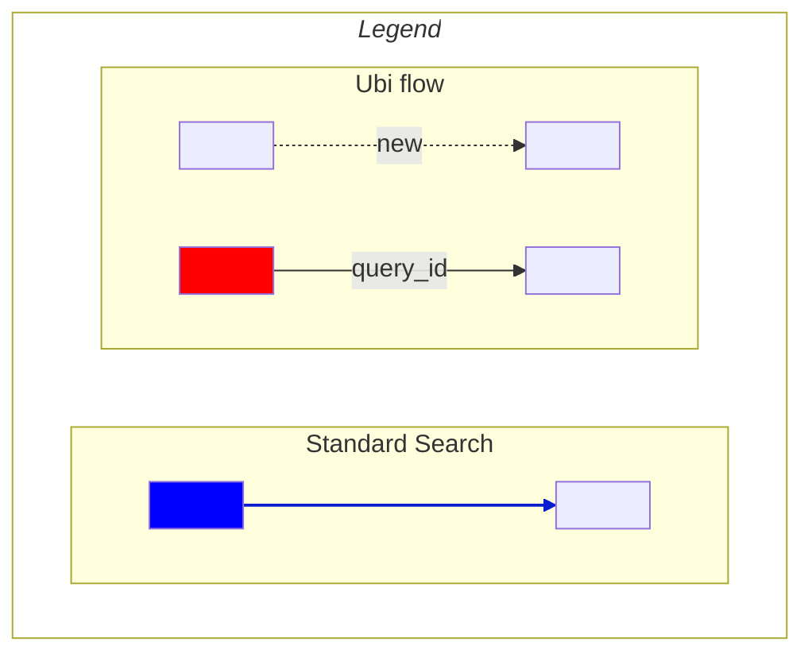
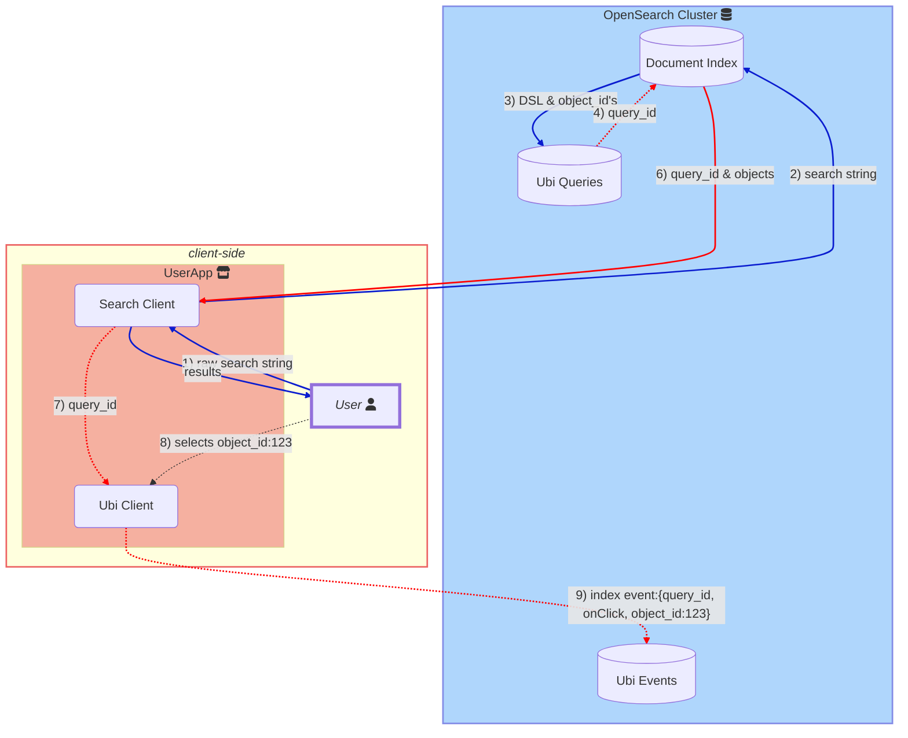

# Key UBI concepts
## Ubi Roles
- **User Behavior Insights** module: once activated, is in charge of indexing a user's queries and results in the **query store** with a unique [`query_id`](#query_id), and passing that `query_id` back to the search client.
  
- **Search Client**: in charge of searching and recieving the `query_id` from **User Behavior Insights**.  This `query_id` is then passed to the **Ubi Logging Client**
  
- **Ubi Logging Client**: is in charge of indexing user events, such as onClick, in the **event store** along with the `query_id` that links to the underlying, technical query DSL and the results' `object_id`'s.

*Note:* We break out the roles of "search" and "Ubi logging" here, but many implementations will likely use the same OpenSearch client instance for both roles of searching and index writing.

linkStyle 2,4,6,8,10 stroke-width:2px,fill:none,stroke:red

Although the named fields below follow a schema which lends to easier analytics, the schema is dynamic and allows for users to add new dynamic fields where there is need.

[`user_id`](#user_id) represents a user.  When UBI is active, any query that this user does, will generate a new `query_id` for this `user_id`.

The purpose of the [`query_id`](#query_id)'s help link the user's raw query string to the results, as well as any subsequent action that the UBI client logs. 
When UBI is turned on, a *search client* will get a `query_id` back from OpenSearch, and is passed to the UBI client.  The UBI client then associates each subsequent event with this query until it receives a new query_id.

[`action_name`](#action_name) says what the name of the event is.  It can be any name, such as *login*, *logout*, *save*, *post*, *add_to_cart*...

 [`event_attributes`](#event_attributes)'s is where any relevant information about the event can be stored.  
 The two primary, predefined objects in the attributes are [`event_attributes.position`](#position), which contains 
 information on what part of the application the user is interacting with, 
 and [`event_attributes.object`](#object), which contains identifying information of the object returned from the query that the user interacts with (i.e.: a book, a product, a post, etc..).

The `object` structure has two ways to refer to the object:
- `event_attributes.object.object_id` is the unique id that OpenSearch uses internally to index the object, think the `_id` field in the indices.
- `event_attributes.object.catalog_id` is the id that a user could look up the object in a *catalog*

 Therefore, the `query_id` signals the beginning of a user's *Search Journey*,
`action_name` tells us how the user is interacting with the query results within the application, 
and `event_attributes.object` is referring to the precise query result that the user interacts with.

### OpenSearch Data Mappings

#### Schema for events:

The current event mappings file can be found [here](../src/main/resources/events-mapping.json).

**Primary fields include:**
- `application` 
  

	&ensp; (size 100) - name of application tracking UBI events
- `action_name` 
  

	&ensp; (size 100) - any name you want to call your event
- `timestamp`: 

   &ensp; Unix epoch time. <s>If not set , will be set by the plugin when the event is received</s> 
- `query_id`  
  

	&ensp;  (size 100) - ID for some query.  Either the client provides this, or the `query_id` is generated by the server.
- `user_id`. `session_id`, `source_id`  

	&ensp; (size 100) - are id's largely at the calling client's discretion for tracking users, sessions and sources (i.e. pages) of the event.  
	The `user_id` must be consistent in both the `query` and `event` stores.
- `message_type`  
  
	&ensp; (size 100) - originally thought of in terms of ERROR, INFO, WARN, but could be anything useful such as `QUERY` or `CONVERSION`.  
	Can be used to group `action_name` together in logical bins.

- `message`  
  
	&ensp; (size 256) - optional text for the log entry

**Other attribute fields & data objects** 

- `event_attributes.object`  
  
	&ensp; represents the search result object (i.e. books, products, user info, etc) if there are any

  - `event_attributes.object.internal_id` - points to a unique, internal, id representing and instance of that object
  
  - `event_attributes.object.object_id`  
  

	&ensp; points to a unique, external key, matching the item that the user searched for, found and acted upon (i.e. sku, isbn, ean, etc.). 
    **This field value should match the value in for the object's value in the `Object_id` [below](#object_id) from the search store**
     It is possible that the `object_id` and `internal_id` match if the same id is used both internally for indexing and externally for the users. 

  - `event_attributes.object.object_type`
  
	&ensp; indicates the type/class of object

  - `event_attributes.object.description`  
  
	&ensp; optional description of the object
  
  - `event_attributes.object.transaction_id`  
  
	&ensp; optionally points to a unique id representing a successful transaction
  
  - `event_attributes.object.to_user_id`  
	
	&ensp; optionally points to another user, if they are the recipient of this object, perhaps as a gift, from the user's `user_id`
  - `event_attributes.object.object_detail` 
	
	&ensp; optional text for further data object details
	 
	  - `event_attributes.object.object_detail.json`  
  
	&ensp; if the user has a json object representing what was acted upon, it can be stored here; however, note that that could lead to index bloat if the json objects are large.

- `event_attributes.position`  
	
	&ensp; nested object to track user events to the location of the event origins
  - `event_attributes.position.ordinal`  
	
	&ensp; tracks the nth item within a list that a user could select, click

  - `event_attributes.position.{x,y}`  
	
	&ensp; tracks x and y values, that the client defines

  - `event_attributes.position.page_depth`  
	
	&ensp; tracks page depth

  - `event_attributes.position.scroll_depth`  
	
	&ensp; tracks scroll depth

  - `event_attributes.position.trail`  
	
	&ensp; text field for tracking the path/trail that a user took to get to this location

* Note the developers can add optional, dynamic fields like `user_name`, `email`, `price` per individual use-cases.

####  Schema for queries:

The current query mappings file can be found [here](../src/main/resources/queries-mapping.json).

- `timestamp`  
	
	&ensp; A unix timestamp of when the query was received

- `query_id`  
	
	&ensp; A unique ID of the query provided by the client or generated automatically.  The same query text issued multiple times would generate different `query_id`.  

- `query_response_objects_ids`  
	
	&ensp; This is an array of the `object_id`'s.   

- `user_id`  
  
	&ensp; A user ID provided by the client

- `session_id`  
  
	&ensp; An optional session ID provided by the client
