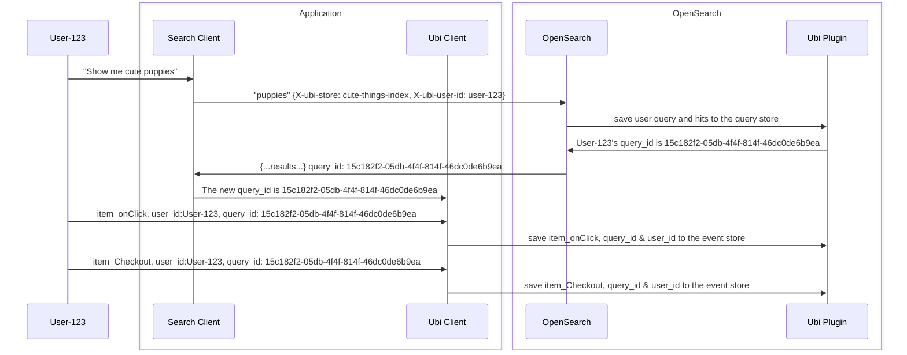

# Basic Ubi flow
**Executive Summary**: Once a user performs search, that search is tied to a `query_id`.  Then any following user events until the next search are logged and indexed by the search's `query_id`. 

### Ubi Roles
- **Ubi Plugin**: in charge of initiating an Ubi store, saving all incoming queries associated with an Ubi store, and logging the Ubi events directly.
- **Search Client**: in charge of searching and recieving a `query_id` from the **Ubi Plugin**.  This `query_id` is then passed to the **Ubi Client**
- **Ubi Client**: in charge of logging user events, such as onClick, passing the data to the **Ubi Plugin**, with the appropriate `query_id`, if the event follows a search event that produced a `query_id`. 

### Ubi `query_id` Sequence

1) The user searches for something like "cute puppies"
2) The search client forwards that request to OpenSearch
   - The query is transformed under the hood and saved to the query store with the hits
   - If no `query_id` is passed in with the request headers, the server generates a new `query_id` and sends it back to the client.
   - If the search client passes in a `query_id` with the search, the server will associate the query in the query store with the client's id
3) Once the Ubi Client has a `query_id`, associated with the user's query, all subsequent user events are logged with this `query_id` until the user initiates a new search.