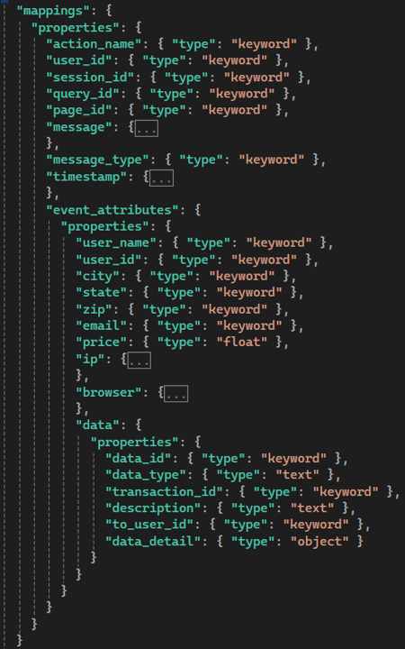

# Event Schema
## Primary fields include:
- `action_name` - any name you want to call your event 
- `timestamp` - should be set automatically
- `user_id`. `session_id`, `page_id` - are id's largely at the calling client's discretion for tracking users, sessions and pages 
- `query_id` - ID for some query.  Note that it could be a unique search string, or it could represent a cluster of related searches (i.e.: *dress*, *red dress*, *long dress* could all have the same `query_id`).  Either the client could control these, or the `query_id` could be retrieved from the API's response headers as it keeps track of queries on the node
- `message_type` - originally thought of in terms of ERROR, INFO, WARN...but could be anything useful such as `QUERY` or `PURCHASE` 
- `message` - optional text for the log entry

## Other fields & data objects
- `event_attributes` - contains various, common attributes associated with many user events
- `event_attributes.data` - contains an associated JSONified data object (i.e. products, user info, etc) if there are any
- `event_attributes.data.data_type` - indicates the type/class of object
- `event_attributes.data.data_id` - points to a unique id representing and instance of that object
- `event_attributes.data.description` - optional description of the object
- `event_attributes.data.transaction_id` - optionally points to a unique id representing a successful transaction
- `event_attributes.data.to_user_id` - optionally points to another user, if they are the recipient of this object
- `event_attributes.data.data_detail` - optional data object/map of further data details